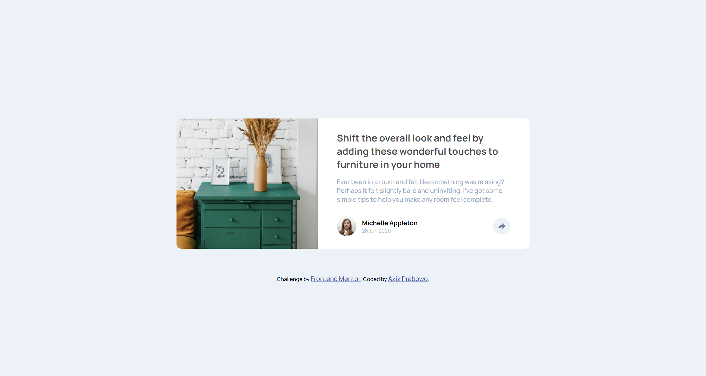

# Frontend Mentor - Article preview component solution

This is a solution to the [Article preview component challenge on Frontend Mentor](https://www.frontendmentor.io/challenges/article-preview-component-dYBN_pYFT). Frontend Mentor challenges help you improve your coding skills by building realistic projects.

## Table of contents

- [Overview](#overview)
  - [The challenge](#the-challenge)
  - [Screenshot](#screenshot)
  - [Links](#links)
- [My process](#my-process)
  - [Built with](#built-with)
  - [What I learned](#what-i-learned)
  - [Useful resources](#useful-resources)
- [Author](#author)

## Overview

### The challenge

Users should be able to:

- View the optimal layout for the component depending on their device's screen size
- See the social media share links when they click the share icon

### Screenshot



### Links

- Solution URL: [SOLUTION](https://www.frontendmentor.io/solutions/article-preview-component-using-css-flexbox-and-vanilla-js-14_FLkMWOg)
- Live Site URL: [LIVE SITE](https://azizp128.github.io/Article-Preview-Component/)

## My process

### Built with

- Semantic HTML5 markup
- CSS custom properties
- Flexbox
- Mobile-first workflow

### What I learned

This is the first time I realized that using absolute position in the relative parent is the best way to keep the overflow element fixed and not moving around when the screen is resized. I also learned new JS syntax in this challenge.

See code snippets below:

```css
.container {
  display: flex;
  flex-direction: column;
  place-items: center;
  place-content: center;
}

.card {
  position: relative;
  display: flex;
  width: 50%;
  min-width: 720px;
}

.share {
  background-color: var(--clr-share-bg);
  position: absolute;
  padding: 1em 1.5em;
  bottom: 5.5em;
  right: -5.3em;
  display: flex;
  justify-content: space-around;
  align-items: center;
  border-radius: 10px;
  width: 100%;
  max-width: 200px;
}

.share::after {
  position: absolute;
  content: "";
  background-color: var(--clr-share-bg);
  top: 34px;
  right: 90px;
  height: 20px;
  width: 20px;
  -webkit-transform: rotate(45deg);
  transform: rotate(45deg);
}
```

```js
profileShareBtn.addEventListener("click", () => {
  if (window.innerWidth < 1000) {
    share.style.display = "flex";
    profile.style.display = "none";
  }

  if (window.innerWidth > 1000) {
    if (share.style.display == "none" && profileShareBtn.style.backgroundColor != "hsl(212, 23%, 69%)") {
      share.style.display = "flex";
      profileShareBtn.style.backgroundColor = "hsl(212, 23%, 69%)";
    } else {
      share.style.display = "none";
      profileShareBtn.style.backgroundColor = "hsl(210, 46%, 95%)";
    }
  }
});
```

### Useful resources

- [Absolute Position](https://codepen.io/azizp128/pen/jOxLbPV?editors=1100) - This helped me for solving the absolute position for the share class.
- [Hide & Show Toggle Element](https://www.w3schools.com/howto/howto_js_toggle_hide_show.asp) - This helped me for solving the JS toggle show and hide on the share class.

## Author

- Frontend Mentor - [@azizp128](https://www.frontendmentor.io/profile/azizp128)
- Twitter - [@azizprbw](https://www.twitter.com/aziprbw)
